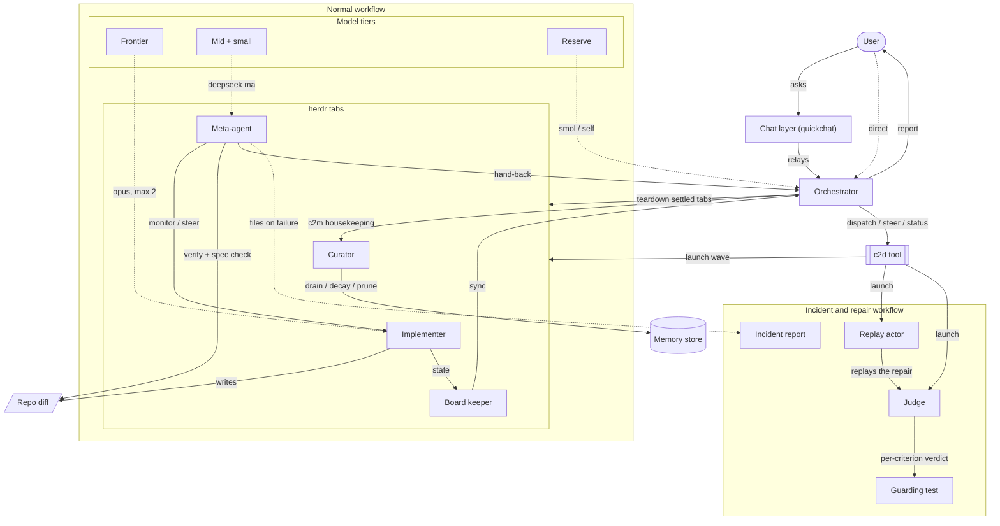

# Catalyst agent jobs

Every catalyst-v2 agent, its job, and the workflow it belongs to, in one diagram with a role table under it.

## Diagram

## Roles at a glance

| Agent or job | Workflow | Does | Tier or model | Lifecycle place |
|---|---|---|---|---|
| User | Normal | States intent, answers design questions, approves, reads the final report | n/a | Opens and closes the effort |
| Chat layer (quickchat) | Normal | Front door that relays verbatim between user and orchestrator, escalates on demand, launches the orchestrator once | deepseek-v4-flash at thinking max | Opt-in at session start |
| Orchestrator | Normal | Scoping, plans and specs, dispatch, reviews, board and memory coordination, audits the meta-agent report, teardown, user report | kimi k3 at thinking high, one long-lived session | Runs the whole effort |
| c2d tool | Both | Dispatch, steer, status; brings each agent up verified in the right herdr tab and hands back a wake | Tool, JSON in and out | Dispatch surface for every launch |
| Implementer | Normal | Executes one spec doc, runs its acceptance gates, escalates blockers | Frontier claude-opus-4-8 (max 2 concurrent) for contract-defining work, else deepseek-v4-flash at thinking max | One per task, short-lived |
| Board keeper | Normal | Keeps the external status board in sync as implementers report state | Claude Sonnet at effort low, one session | Pre-work through finish |
| Meta-agent | Both | Monitors the wave, corrective steers, holds sole verification of the whole change, checks the diff against each task's spec, repairs instruction files, files incidents, delivers the hand-back | deepseek-v4-flash at thinking max (opus for hard multi-agent diagnosis) | Fresh per dispatch wave, retired at hand-back |
| Curator | Normal | Drains the memory inbox, promotes, decays, and prunes entries to tombstones through c2m | Curator model from models.yaml, fresh and autonomous | Effort or session close, or user summon |
| Replay actor | Incident | Re-runs the repair scenario in a fresh session that reads only live instructions; delivers the artifact in its reply or from a scratch copy | Actor role from test.yaml | Repair verification |
| Judge | Incident | Scores the replay per criterion, binary verdicts with justifications; always a model distinct from the actor | claude-opus-4-8 | Self-test runs, manual trigger |
| Reserve | Normal | Independent verification reruns, triage, smoke-test driving | Orchestrator own session or omp smol/tiny | As needed, sparingly |

## Reading the diagram

- Two workflows, one team. The normal workflow runs every effort: user, chat layer, orchestrator, delegates in herdr tabs, meta-agent, curator. The incident workflow runs only when a meta-agent files an incident and a skill or tool repair needs a guarded replay: replay actor, judge, guarding test.
- Solid arrows carry the jobs: dispatch, launch, monitor, verify, spec check, hand-back, sync, housekeeping, teardown, report.
- Dotted arrows map a model tier to a role: frontier is claude-opus-4-8 capped at 2 concurrent, mid and small run deepseek-v4-flash at thinking max, reserve is the orchestrator session or omp smol/tiny.
- The meta-agent owns verification and the spec check: it confirms gate output, runs the whole-change check, and reads the diff against each task's spec before the hand-back.
- The judge appears only in the incident lane. It launches with the self-testing runner, and its verdict lands in the test history.
- Delegates live in herdr tabs and come up through c2d; the orchestrator closes settled tabs at teardown once the meta-agent declares each one retired.
